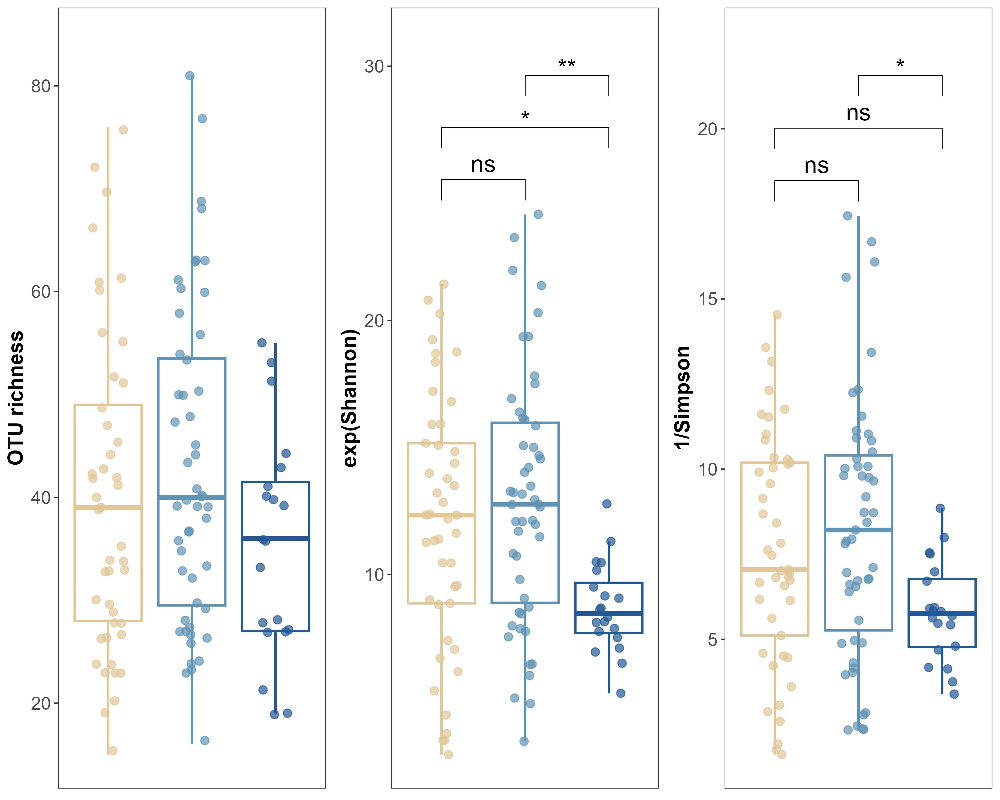

# Alpha diversity: Diversity indexes using vegan 

Cristina Martínez Rendón  
25-10-2023  

**R version:** 4.3.0 (21-04-2023)

**Packages**
``` r
library(tidyverse)
library(vegan)
library(cowplot)
library(agricolae)
library(car)
library(rstatix)
library(ggsignif)
library(ggpubr)

rm(list = ls())

setwd("~/R_Projects/ArcticAntarctica/GreenAlgae") # Location of this R script. 

set.seed(850511)
``` 

Here, I calculated various diversity indices, including OTU richness, Shannon, Simpson, Inverse Simpson, and Pielou’s Evenness, using non-rarefied, filtered count data with the vegan package in R. To further analyze diversity, I also computed Hill numbers for scales 0 (OTU richness), 1 (Exponential Shannon), and 2 (Inverse Simpson), though Hill 0 and Hill 2 yielded redundant results, matching the previously calculated indices. The results were integrated with metadata and analyzed using ANOVA to assess differences across sample sets, followed by post-hoc tests for significant findings. Finally, the diversity indices were visualized using box plots. 


## 1. Calculation of diversity indexes
``` r
# Relativized count table. Non-rarefied data, filtered (K2|TOT|TCtr|C1 sites), deleted OTUs that col.summed=0, or those present in =< 3 samples. I need both tables, this one does not have the taxonomy column. This table I produced in the NMDS script.
relcounttable <- read.table("Species_mat_relativ.txt", header=T,row.names = 1) 
counttable <- relcounttable
``` 
### 1.1 OTU richness
``` r
richness <- specnumber(counttable)
richness <- data.frame(richness)
```

### 1.2 Shannon Index
The Shannon index is a measure for both species richness and evenness. As higher the evenness and richness within a Community/sample as higher the index. The Shannon index has more weight on species richness and thus it gives ‘more importance’ to rare species.
``` r
# We calculate the Shannon index from count data for each sample using the function diversity (package vegan). 
shannon <- diversity(counttable, index = "shannon")

# Convert vector to data frame and set row names as a new column called 'SampleID'
alphadiv <- data.frame(shannon)
alphadiv$otu_richness <- richness$richness
alphadiv$SampleID <- rownames(alphadiv)

# Load metadata, combine species richness data and metadata to one data frame
# For by.y choose the column with your sample IDs, if by.y=0 rownames are used
metadata <- read.table("SampleMetadata.txt", header = TRUE, row.names = "names_site")
common_rows <- data.frame(rownames(metadata) %in% rownames(alphadiv))
metadata_subset <- metadata[unlist(common_rows), ]

alphadiv$Set <- factor(metadata_subset$set, levels = c("Arctic", "An_Pen", "An_Cont"))
alphadiv$uniqsample <- as.factor(metadata_subset$uniqsample)
```

### 1.3 Simpson Indexes
The Simpson index is a measure for both species richness and dominance (dominance is complimentary to evenness). The index assumes that diversity is inversely related to the probability that two randomly picked individuals belong to the same species. While the index increases with species richness within a community/sample it decreases with increasing dominance as it involves the sum of the squares of the frequencies (and the square of a very small frequency is a very small number).

``` r
# Calculate species richness. Before calculating the Simpson indices, we transpose the count data to have sample 
# IDs as the row names and taxa IDs as the column names.
simpson <- diversity(counttable, index = "simpson")
inverse_simpson <- diversity(counttable, index = "invsimpson")

# 1. Convert vector to data frame and set row names as a new column called 'SampleID'
simpson <- data.frame(simpson)
inverse_simpson <- data.frame(inverse_simpson)

# 2. Integrate them to the data frame with the metadata.
alphadiv$simpson <- simpson$simpson
alphadiv$inverse_simpson <- inverse_simpson$inverse_simpson
``` 

### 1.4 Pielou’s Evenness Index
Measure of how even the individual species are in relation to each other. Communities/samples where all species are equally common have high evenness (index = 1), while communities/samples with few dominant species and many species that are relatively rare have low evenness (index = 0).
``` r
# Calculate pielou's vegan, log = ln by default
pielou <- shannon/log(richness)
pielou <- data.frame(pielou)

alphadiv$pielou <- pielou$richness
alphadiv <- alphadiv[c("SampleID", "Set", "uniqsample", "otu_richness", "shannon", "simpson", "inverse_simpson", "pielou")]
``` 


## 2. Statistics
# I didn't test for normality. Sampling size is large (n = 116), data is not strongly skewed. Run Anovas.

### ANOVA 
``` r
# Specify your diversity index column names
diversity_indices <- c("otu_richness", "shannon", "simpson", "inverse_simpson", "pielou")

# Create an empty list to store ANOVA results
anova_results <- list()

# Loop through each diversity index
for (index in diversity_indices) {
  # Run ANOVA
  anova_result <- anova_test(as.formula(paste(index, "~ Set")), data = alphadiv)  # alternative withot p values: aov()
  # anova_result <- TukeyHSD(model, which = "Set") #TukeyHSD() / LSD.test() alternatively ; rstatix::tukey_hsd() ; agricolae::HSD.test() 
  
  # Store ANOVA result in the list
  anova_results[[index]] <- anova_result
}

# Access ANOVA results for each diversity index
for (index in diversity_indices) {
  print(anova_results[[index]])
}
``` 
### ANOVA results: 

#### ANOVA Table (type II tests)
**otu_richness** 
 Effect DFn DFd      F        p p<.05   ges
	1   Set   2 113 1.853 0.162       0.032   no es significativo.

**shannon**
Effect DFn DFd     F        p p<.05   ges
	1    Set   2 113 4.302 0.016     * 0.071  

**simpson**
Effect DFn DFd     F     p p<.05   ges
	1    Set   2 113 0.504 0.605       0.009  no es singificativo.

**inverse_simpson**
Effect DFn DFd     F     p p<.05   ges
	1    Set   2 113 3.888 0.023     * 0.064

**pielou**
Effect DFn DFd     F     p p<.05   ges
	1    Set   2 113 2.151 0.121       0.037 no es singificativo.

### Post-hoc comparisons:
``` r
tukey_hsd(index ~ Set)

pwc_otu <- alphadiv %>%
  tukey_hsd(otu_richness ~ Set); pwc_otu
pwc_otu <- pwc_otu %>% add_xy_position(x = "Set")
```
> pwc_otu
term  group1 group2  null.value estimate conf.low conf.high  p.adj p.adj.signif
	* <chr> <chr>  <chr>        <dbl>    <dbl>    <dbl>     <dbl>  <dbl> <chr>       
	1 Set   Arctic An_Pen           0     2.95    -4.20     10.1  0.591 ns          
	2 Set   Arctic An_Cont          0    -4.43   -13.8       4.96 0.504 ns          
	3 Set   An_Pen An_Cont          0    -7.38   -16.6       1.84 0.143 ns      
``` r

pwc_inv_simpson <- alphadiv %>% 
  tukey_hsd(inverse_simpson ~ Set); pwc_inv_simpson
pwc_inv_simpson <- pwc_inv_simpson %>% add_xy_position(x = "Set")
```
> pwc_inv_simpson 
term  group1 group2  null.value estimate conf.low conf.high p.adj p.adj.signif
	* <chr> <chr>  <chr>        <dbl>    <dbl>    <dbl>     <dbl> <dbl> <chr>       
	1 Set   Arctic An_Pen           0    0.654   -0.973     2.28  0.607 ns          
	2 Set   Arctic An_Cont          0   -1.81    -3.95      0.328 0.114 ns          
	3 Set   An_Pen An_Cont          0   -2.46    -4.56     -0.365 0.017 *    


## 3. Plot

``` r
otu_ggboxplot <- ggboxplot(
  alphadiv, x = "Set", y = "otu_richness",
  color = "Set", palette = c("#E1C697", "#5F93B5", "#225895"),
  width = 0.8, size = 0.8, add = "jitter", add.params =list(size = 2.5, alpha=0.7)) +
  #stat_pvalue_manual(pwc_otu, hide.ns = F, label = "{p.adj.signif}", size = 6) +
  labs(y = "OTU richness") +
  scale_y_continuous(expand = expansion(mult = c(0.05, 0.10))) +
  theme_bw() +
  theme(panel.grid.major = element_blank(),
        panel.grid.minor = element_blank()) +
  theme(axis.text=element_text(size=13),
        axis.title=element_text(size=15, face = "bold"),
        axis.title.x=element_blank(),
        axis.text.x = element_blank(),
        axis.ticks.x = element_blank(),
        legend.position = "none",
        strip.text.y = element_text(size=13, face = "bold")) +
  theme(panel.background = element_rect(fill = "transparent", colour = NA),
        plot.background = element_rect(fill = "transparent", colour = NA)); otu_ggboxplot

# ggsave(file = "Plots/Alpha_diversity_GreenA_H0OTU1.pdf", dpi=300, width = 2.5, height = 4.5)


inv_simpson_ggboxplot <- ggboxplot(
  alphadiv, x = "Set", y = "inverse_simpson", 
  color = "Set", palette = c("#E1C697", "#5F93B5", "#225895"), 
  width = 0.8, size = 0.8, add = "jitter", add.params =list(size = 2.5, alpha=0.7)) +
  stat_pvalue_manual(pwc_inv_simpson, hide.ns = F, label = "{p.adj.signif}", size = 6) +
  labs(y = "1/Simpson") +
  scale_y_continuous(expand = expansion(mult = c(0.05, 0.10))) +
  theme_bw() +
  theme(panel.grid.major = element_blank(),
        panel.grid.minor = element_blank()) +
  theme(axis.text=element_text(size=13), 
        axis.title=element_text(size=15, face = "bold"), 
        axis.title.x=element_blank(),
        axis.text.x = element_blank(),
        axis.ticks.x = element_blank(),
        legend.position = "none",
        strip.text.y = element_text(size=13, face = "bold")) +
  theme(panel.background = element_rect(fill = "transparent", colour = NA),  
        plot.background = element_rect(fill = "transparent", colour = NA)); inv_simpson_ggboxplot

# ggsave(file = "Plots/Alpha_diversity_Diat_H2InvSimpso1.pdf", dpi=300, width = 2.5, height = 4.5)
``` r


## 4. Hill Numbers

We calculate Hill numbers with alpha = 0, 1 & 2 from count data for each sample using the function renyi (package vegan). If needed, we transpose the count data to have sample IDs as the row names and taxa IDs as the column names.

### 4.1. OTU Richness: This corresponds to 𝑞= 0, where no weighting by relative abundance occurs, so every OTU is counted equally, representing the total species (or OTU) richness.

### 4.2. Exponential Shannon: This corresponds to 𝑞= 1, which is the exponential of the Shannon entropy. This metric takes into account both the richness and evenness of species in the community, giving more weight to species that are more evenly distributed.

### 4.3. Inverse Simpson: This corresponds to 𝑞= 2, which is the inverse of the Simpson index. This metric gives more weight to the more abundant species, reflecting the probability that two randomly chosen individuals from the dataset belong to different species.

``` r
# Calculate hill numbers for alpha = 0, 1, 2
renyi <- renyi(counttable, hill = T, scales = c(0, 1, 2)) 

# I ran this with the relativized count table. H0 is the same as OTU richness, and H2 is the same as 1/Simpson

renyi$Set <- factor(metadata_subset$set, levels = c("Arctic", "An_Pen", "An_Cont"))
renyi$uniqsample <- as.factor(metadata_subset$uniqsample)

# Change the column names in the renyi object
colnames(renyi) <- c("hill0", "hill1", "hill2", "Set", "uniqsample")
```

## 5. H1 statistics

### ANOVA 
``` r
# Specify your diversity index column names
diversity_indices_hill <- c("hill0", "hill1", "hill2")

# Create an empty list to store ANOVA results
anova_results_hill <- list()

# Loop through each diversity index
for (index in diversity_indices_hill) {
  # Run ANOVA
  anova_result_hill <- anova_test(as.formula(paste(index, "~ Set")), data = renyi)  # alternative withot p values: aov()
  # anova_result <- TukeyHSD(model, which = "Set") #TukeyHSD() / LSD.test() alternatively ; rstatix::tukey_hsd() ; agricolae::HSD.test() 
  
  # Store ANOVA result in the list
  anova_results_hill[[index]] <- anova_result_hill
}

# Access ANOVA results for each diversity index
for (index in diversity_indices_hill) {
  print(anova_results_hill[[index]])
}
```

### ANOVA results: 

#### ANOVA Table (type II tests)

**Hill0**
Effect DFn DFd      F        p p<.05   ges
	1    Set   2 113 1.853 0.162       0.032

**Hill1**
Effect DFn DFd     F        p p<.05   ges
	1    Set   2 113 6.278 0.003     * 0.1

**Hill2** 
Effect DFn DFd     F     p p<.05   ges
	1    Set   2 113 3.888 0.023     * 0.064

### Post-hoc comparisons:
``` r
tukey_hsd(index ~ Set)

# Tukey multiple comparisons of means
# 95% family-wise confidence level

pwc_hill1 <- renyi %>% 
  tukey_hsd(hill1 ~ Set); pwc_hill1
pwc_hill1 <- pwc_hill1 %>% add_xy_position(x = "Set")
``` 
> pwc_hill1
term  group1 group2  null.value estimate conf.low conf.high    p.adj p.adj.signif
	1 Set   Arctic An_Pen           0    0.875    -1.34     3.09  0.617   ns          
	2 Set   Arctic An_Cont          0   -3.36     -6.27    -0.454 0.0191  *           
	3 Set   An_Pen An_Cont          0   -4.24     -7.09    -1.38  0.00177 ** 


## 5. H1 Plot
``` r
color_light <- c("#FFE4B5", "#4A80BD", "#87B8D9")

hill1_ggboxplot <- ggboxplot(
  renyi, x = "Set", y = "hill1", 
  color = "Set", palette = c("#E1C697", "#5F93B5", "#225895"), 
  width = 0.8, size = 0.8, add = "jitter", add.params =list(size = 2.5, alpha=0.7)) +
  stat_pvalue_manual(pwc_hill1, hide.ns = F, label = "{p.adj.signif}", size = 6) +
  labs(y = "exp(Shannon)") +
  scale_y_continuous(expand = expansion(mult = c(0.05, 0.10))) +
  theme_bw() +
  theme(panel.grid.major = element_blank(),
        panel.grid.minor = element_blank()) +
  theme(axis.text=element_text(size=13), 
        axis.title=element_text(size=15, face = "bold"), 
        axis.title.x=element_blank(),
        axis.text.x = element_blank(),
        axis.ticks.x = element_blank(),
        legend.position = "none",
        strip.text.y = element_text(size=13, face = "bold")) +
  theme(panel.background = element_rect(fill = "transparent", colour = NA),  
        plot.background = element_rect(fill = "transparent", colour = NA)); hill1_ggboxplot

ggsave(file = "Plots/Alpha_diversity_GreenAlgae_H1expShannon1.pdf", dpi=300, width = 2.5, height = 4.5)

plot_grid(otu_ggboxplot, hill1_ggboxplot, inv_simpson_ggboxplot, ncol=3)

ggsave(file = "Plots/Alpha_diversity_GreenAlgae_HillNumbers_240809.png", dpi=300, width = 10, height = 8)
``` 

 

