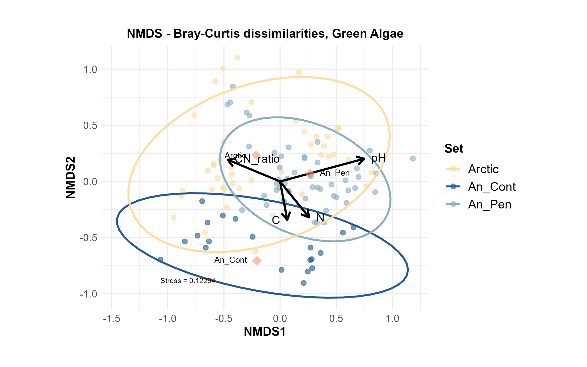

# Non-metric dimensional scaling (NMDS) 

Cristina Martínez Rendón  
14-09-2023


In NMDS, the goal is to represent high-dimensional data in a reduced-dimensional space while preserving the original pairwise distances (or dissimilarities) as much as possible. 
- Visualizing and exploring the dissimilarity or distance between objects based on their attributes  
- NMDS handle dissimilarity or distance measures that are not necessarily based on strict numeric scales  
- useful tool for exploratory analysis, visualization, and understanding the underlying structure or relationships within a dataset based on dissimilarities or distances between objects.  

**R version:** 4.3.0 (21-04-2023)

**Packages**
``` r
library(vegan)
library(tidyverse)
library(ggpubr)
library(funrar)
library(RColorBrewer)
library(plyr)
library(ggrepel)
library(ape)

rm(list = ls())

setwd("~/R_Projects/ArcticAntarctica/GreenAlgae") 

set.seed(850511)
``` 

## 1. Data handling  
I processed and filtered OTU count data by removing unwanted columns and rows, excluding OTUs with fewer than three non-zero values, and transforming the data for further analysis. I then matched and filtered the associated sample metadata, integrated relevant environmental data, and checked for any remaining singletons or zero-sum OTUs, which were subsequently removed. Finally, I ensured that both the raw and relative abundance matrices were cleaned of zero-sum OTUs for downstream analyses.
``` r
counttable <- read.delim("305WP2PolarGA.unique.agc.txt", header=T, row.names = 1)

### Filter out things from the table using base R
counttable <- counttable[,-which(colnames(counttable) %in% c("SUM","repSeqName","repSeq","OTUConTaxonomy","mock_community"))]
counttable <- as.data.frame(t(counttable))
row.names(counttable) <- gsub("^X","",row.names(counttable))
counttable <- filter(counttable, !grepl( "K2|TOT|TCtr|unused|C1", row.names(counttable)))

# Remove columns (OTUs) with less than three non-zero values
counttable <- counttable[,colSums(counttable > 0) >= 3]

# Continue with a tibble
counttable <- as_tibble(counttable, rownames = "names") %>%
  mutate(names_site = str_replace(names, "(\\d_\\d)(?!.*_An)", "\\1_An")) %>% 
  dplyr::select(names_site, starts_with("Otu"))

  counttable <- as.data.frame(counttable)
  rownames(counttable) <-counttable$names_site
  counttable$names_site <- NULL
  Species_mat = as.matrix(counttable)
  Species_mat_rel = make_relative(Species_mat)
  # write.table(Species_mat_rel, "Species_mat_relativ.txt", sep="\t", col.names=TRUE)

# Load sample info:
info <- read.table("Cristina_info.txt",header=T, row.names=1)
info <- filter(info, !grepl( "K2|TOT|TCtr|unused|C1", row.names(info)))
info$names <- rownames(info)
rownames(info) <- NULL
info$uniqsample <- paste0(info$set,"_",info$sample)

info <- as_tibble(info) %>%
  mutate(names_site = str_replace(names, "(\\d_\\d)(?!.*_An)", "\\1_An")) %>% 
  select(names_site, everything()) %>% 
  select(-names) #%>% 

  SampleMetadata = info
  SampleMetadata$set = as.factor(SampleMetadata$set)
  SampleMetadata$uniqsample = as.factor(SampleMetadata$uniqsample)
  
# Add edaphic data: data_env! Filter it to match samples included in "counttable" and "info" 
  data_env <- read.table("../Metadata/Polar_metadata_complete.txt", row.names = "name", header=T) %>% 
    select(pH, mean_N_per100, mean_C_per100, mean_CN_ratio, P_gperkg, set)

  pcoa1_Cerco <- read.delim("../Cercozoa/pcoa1_Cercozoa.csv", header=T, row.names = 1, sep = ",") 
  data_env$pcoa1_Cerco <- pcoa1_Cerco$MDS1
  
  pcoa1_Diat <- read.delim("../Diatoms/pcoa1_Diat.csv", header=T, row.names = 1, sep = ",") 
  data_env$pcoa1_Diat <- pcoa1_Diat$MDS1

# I also check if there are still singletons or 0s: 
    colsums <- sort(colSums(Species_mat), decreasing = TRUE)
    colsums
# And I'll get rid already of the OTUs that sum up 0
    Species_mat <- Species_mat[, !(colSums(Species_mat) == 0)]
    Species_mat_rel <- Species_mat_rel[, !(colSums(Species_mat_rel) == 0)]
```
    
## 2. Calculate Beta Diversity and green algal PCoA  
``` r  
# Bray-Curtis-distances and stress values. Compositional dissimilarity between two different sites, based on counts at each site.
  # I decided not to rarefy, only to normalize, so I go directly to: 
  Dist_Poles <-  vegdist(Species_mat_rel, method="bray", diag = T, na.rm = T)
  set.seed(850511)
  OTU.NMDS.bray_Poles <-  metaMDS(Dist_Poles, k=3, trymax=200, wascores=TRUE, trace=TRUE, zerodist="add")

  # Calculate PCoAs for each sample for green algae. These results will later be used on the NMDS plots of the other two taxa.
  pcoa_GA <- capscale(Species_mat_rel ~ 1, dist="bray")
  
  # Plot scree plot
  barplot(pcoa_GA$CA$eig, names.arg=c(1:length(pcoa_GA$CA$eig)), 
          main="Scree plot", xlab="Eigenvalue index", ylab="Eigenvalue")
  
  # Extract eigenvectors and the proportion of variance explained. The first axis (PCoA1) of each taxon’s community was used to predict those of the others. 
  Eigenvectors <- data.frame(scores(pcoa_GA, choices=1:2, display="sites"))
  VarExplained=data.frame(summary(eigenvals(pcoa_GA))[,1:2])
  
  # MDS1      MDS2
  # Eigenvalue            5.4146474 3.7271095
  # Proportion Explained  0.2070286 0.1425057
  # Cumulative Proportion 0.2070286 0.3495343
  
  # Save the results in a csv to use in the other datasets. 
  write.csv(Eigenvectors, file = "pcoa1_GA.csv", quote=FALSE, row.names=T)
``` 

## 3. Fit environmental vectors and factors  
``` r
  set.seed(850511)
  env <- envfit(OTU.NMDS.bray_Poles, data_env, perm=999, choices=c(1:3))
``` 

> **VECTORS**  
                  NMDS1    NMDS2    NMDS3     r2 Pr(>r)    
pH             0.93321  0.25187  0.25627 0.3991  0.001 ***  
mean_N_per100  0.62684 -0.77630 -0.06658 0.1077  0.007 **  
mean_C_per100  0.12386 -0.66036 -0.74066 0.1490  0.001 ***  
mean_CN_ratio -0.66139  0.27449 -0.69801 0.2500  0.001 ***  
P_gperkg       0.20478 -0.40914 -0.88920 0.0502  0.125    
pcoa1_Cerco    0.81727  0.28775  0.49926 0.5830  0.001 ***  
pcoa1_Diat     0.19592  0.62664 -0.75428 0.1185  0.002 **   
Signif. codes:  0 ‘***’ 0.001 ‘**’ 0.01 ‘*’ 0.05 ‘.’ 0.1 ‘ ’ 1  
Permutation: free  
Number of permutations: 999  

> **FACTORS**  
Centroids:  
             NMDS1   NMDS2   NMDS3  
setAn_Cont -0.1639 -0.5626  0.0603  
setAn_Pen   0.2135  0.0560  0.0564  
setArctic  -0.1691  0.1865 -0.0907  
Goodness of fit:  
        r2 Pr(>r)    
set 0.214  0.001 ***  


### Extract arrows for numeric metadata, I compare two ways. 
``` r
  # 1.
  environmental_vectors <- data.frame(env$vectors$arrows)
  environmental_vectors$x0 <- 0
  environmental_vectors$y0 <- 0
  
  # For the plot, we scale the arrow values by their r-square value. The r-square value indicates how much variation of a dependent variable 
  # is explained by the independent variable. Thus "weak" predictors have shorter arrows than "strong" predictors.
  environmental_vectors$NMDS1 <- environmental_vectors$NMDS1*env$vectors$r
  environmental_vectors$NMDS2 <- environmental_vectors$NMDS2*env$vectors$r
  
  environmental_vectors$p.values <- p.adjust(env$vectors$pvals, method="BH")  # Assign p-values, correct them for multiple testing
  environmental_vectors <- environmental_vectors[environmental_vectors$p.values < 0.05,] # Keep only environmental vectors with p value < 0.05
  environmental_vectors$NewLabels <- c("pH", "N", "C", "CN_ratio", "pcoa1_Cerco", "pcoa2_Diat") # Create a new variable in your data frame with the desired labels

  
  # 2. This approach scales the fitted environmental vectors by the square root of the R-squared value of each vector. 
  # The r-square value indicates how much variation of a dependent variable is explained by the independent variable
  # Thus "weak" predictors have shorter arrows than "strong" predictors. For that, extract r-square value and use for scaling
  env_coord_cont <-  as.data.frame(scores(env, "vectors")) * ordiArrowMul(env) 
  env_coord_cont$x0 <- 0
  env_coord_cont$y0 <- 0
  
  env_coord_cont$p.values <- p.adjust(env$vectors$pvals, method="BH") # Assign p-values, correct them for multiple testing
  env_coord_cont <- env_coord_cont[env_coord_cont$p.values < 0.05,] # Keep only environmental vectors with p value < 0.05
  env_coord_cont$NewLabels <- c("pH", "N", "C", "CN_ratio", "pcoa1_Cerco", "pcoa2_Diat") # Create a new variable with the desired labels
                            # NMDS1      NMDS2       NMDS3 x0 y0    p.values   NewLabels
        # pH             0.70852503  0.1912292  0.19457170  0  0 0.001750000          pH
        # mean_N_per100  0.24725917 -0.3062107 -0.02626353  0  0 0.008166667           N
        # mean_C_per100  0.05745485 -0.3063213 -0.34356763  0  0 0.001750000           C
        # mean_CN_ratio -0.39745930  0.1649547 -0.41946347  0  0 0.001750000    CN_ratio
        # pcoa1_Cerco    0.75000000  0.2640625  0.45816730  0  0 0.001750000 pcoa1_Cerco
        # pcoa1_Diat     0.08105156  0.2592422 -0.31205094  0  0 0.002800000  pcoa2_Diat
 
  #### Categorical data
  env_coord_cat <- as.data.frame(scores(env, "factors")) * ordiArrowMul(env) # I have an overall p value for "set"
  env_coord_cat$Labels <- c("An_Cont", "An_Pen", "Arctic")
``` 

### PERMANOVA        
 Here I include all environmental factors (except CN ratio, which is related to those two factors of course). I change the order of the factors until they were (more or less) organized by descendent value. 
``` r
  permanova_cat2 <- adonis2(Species_mat_rel ~ set + pH + pcoa1_Cerco + mean_C_per100 + pcoa1_Diat + P_gperkg + mean_CN_ratio + mean_N_per100, data = data_env, permutations = 999, method = "bray")
        #                Df SumOfSqs      R2       F Pr(>F)    
        # set             2   3.2840 0.14286 12.6949  0.001 ***
        # pH              1   1.8769 0.08165 14.5111  0.001 ***
        # pcoa1_Cerco     1   1.2339 0.05368  9.5396  0.001 ***
        # mean_C_per100   1   0.8668 0.03771  6.7018  0.001 ***
        # pcoa1_Diat      1   0.7058 0.03071  5.4571  0.001 ***
        # P_gperkg        1   0.6470 0.02815  5.0023  0.001 ***
        # mean_CN_ratio   1   0.3788 0.01648  2.9285  0.006 ** 
        # mean_N_per100   1   0.2835 0.01233  2.1918  0.027 *  
        # Residual      106  13.7103 0.59644                   
        # Total         115  22.9871 1.00000       
  
  # To test whether there are significant differences among the three levels of "set" separately, conduct pairwise tests.
  # Perform pairwise PERMANOVAs to compare each pair of groups (Arctic vs. An_Cont... etc). Generates separate p-values for each pair.
  #if (!require(pairwiseAdonis)) install_github("pmartinezarbizu/pairwiseAdonis/pairwiseAdonis")
  library(pairwiseAdonis)
  pairw_adonis <-  pairwise.adonis(Species_mat_rel, factors = data_env$set, sim.method = "euclidean", p.adjust.m = "BH")
    #               pairs Df SumsOfSqs   F.Model         R2 p.value p.adjusted sig
    # 1 Arctic vs An_Cont  1 1.0095633 10.966884 0.14826749   0.001      0.001  **
    # 2  Arctic vs An_Pen  1 0.4713997  5.239918 0.05280051   0.001      0.001  **
    # 3 An_Cont vs An_Pen  1 0.8814425 10.223368 0.12904486   0.001      0.001  **
    
# get data scores
data.scores = as.data.frame(scores(OTU.NMDS.bray_Poles), display= "sites")
rownames(data.scores) = SampleMetadata$names_site
data.scores$Set = SampleMetadata$set
data.scores$uniqsample = SampleMetadata$uniqsample
data.scores$names_site = SampleMetadata$names_site
data.scores <- as_tibble(data.scores)
data.scores$Set <- factor(data.scores$Set)
``` 
## 4. Plot
``` r
color <- c("#ffb535", "#225895", "#89aec2")  #FFE4B5
color_light <- c("#D6D59C", "#4A80BD", "#87B8D9")
``` 
### 4.1 Create a polygon
``` r
# Convex hulls.
find_hull <- function(data.scores) data.scores[chull(data.scores$NMDS1, data.scores$NMDS2), ]
hulls <- ddply(data.scores, "Set", find_hull)

Plot <- ggplot(data.scores) +
  geom_point(aes(x = NMDS1, y = NMDS2, color = Set),
             size = 2, alpha = 0.6) +
  # geom_text(aes(x = NMDS1, y = NMDS2, label = names_site),
  #           size = 2, nudge_y = 0.03) +
  scale_color_manual(values = color,
                     limits = c("Arctic", "An_Cont", "An_Pen")) +
  geom_text(data = data.frame(x = min(OTU.NMDS.bray_Poles$points[, 1]), 
                              y = min(OTU.NMDS.bray_Poles$points[, 2]), 
                              stress = OTU.NMDS.bray_Poles$stress),
            aes(x, y, label = paste0("Stress = ", round(stress, 5))), 
            hjust = 0, vjust = 0, size = 2.5) +
  # Add arrows:
  geom_segment(data=env_coord_cont, aes(x=x0, y=y0, xend=NMDS1, yend=NMDS2),
               inherit.aes=F, arrow=arrow(length=unit(0.3, "cm")), color="black", lwd=1) +
  geom_text_repel(data=env_coord_cont, aes(x=NMDS1, y=NMDS2,label=NewLabels), 
                  inherit.aes=F, size=4, parse=T, force=T) +
  # And points for the categorical factor "set"
  geom_point(data=env_coord_cat, aes(x = NMDS1, y = NMDS2), 
             shape = "diamond", size = 4, alpha = 0.6, colour = "#FC9272") +
  coord_equal() + 
  theme_minimal() +
  theme(axis.text=element_text(size=10), 
        axis.title=element_text(size=12, face = "bold"), 
        legend.text = element_text(size = 12),
        legend.title = element_text(size = 12, face = "bold"), 
        legend.position = "right",
        legend.text.align = 0,
        legend.direction = "vertical", 
        strip.text.y = element_text(size=12, face = "bold"), 
        plot.title = element_text(size = 12, face = "bold", hjust = 0.5)) +
  theme(strip.text.x = element_text(size=12,face="bold"))+
  ggtitle("NMDS - Bray-Curtis dissimilarities, Green Algae") +
  theme(plot.margin = margin(1,1,1,1, "cm")); Plot

Plot_polygons <- Plot + geom_polygon(data=hulls, aes(x=NMDS1, y=NMDS2, group=Set, fill=Set), alpha=0.2) + 
                      scale_fill_manual(values = c("#D6D59C", "#4A80BD", "#87B8D9"),
                      limits = c("Arctic","An_Cont","An_Pen")); Plot_polygons
  
  ggsave(file = "Plots/NMDS_Polygon_GreenAlgae_240809.png", dpi=300, width = 8, height = 5)  
```   
  
  
### 4.2 Create an ellipse plot
``` r
Ellipse <- ggplot(data.scores) +
  geom_point(aes(x = NMDS1, y = NMDS2, color = Set),
             size = 2, alpha = 0.6) +
  scale_color_manual(values = color,
                     limits = c("Arctic", "An_Cont", "An_Pen")) +
  stat_ellipse(aes(x = NMDS1, y = NMDS2, color = Set), linewidth = 0.9) +
  geom_text(data = data.frame(x = min(OTU.NMDS.bray_Poles$points[, 1]), 
                              y = min(OTU.NMDS.bray_Poles$points[, 2]), 
                              stress = OTU.NMDS.bray_Poles$stress),
            aes(x, y, label = paste0("Stress = ", round(stress, 5))), 
            hjust = 0, vjust = 0, size = 2.5) +
  # Add arrows:l
  geom_segment(data=env_coord_cont, aes(x=x0, y=y0, xend=NMDS1, yend=NMDS2),
               inherit.aes=F, arrow=arrow(length=unit(0.3, "cm")), color="black", lwd=1) +
  geom_text_repel(data=env_coord_cont, aes(x=NMDS1, y=NMDS2,label=NewLabels), 
                  inherit.aes=F, size=4, parse=T, force=T, direction = "x", box.padding = 0.4)  +
  # And points for the categorical factor "set"
  geom_point(data=env_coord_cat, aes(x = NMDS1, y = NMDS2), 
             shape = "diamond", size = 4.5, alpha = 0.6, colour = "#8D2910") +
  geom_text_repel(data=env_coord_cat, aes(x=NMDS1, y=NMDS2,label=Labels), 
                  inherit.aes=F, size=3, parse=T, force=T, box.padding = 0.6, direction = "x") +
  coord_equal() + 
  theme_minimal() +
  theme(axis.text=element_text(size=10), 
        axis.title=element_text(size=12, face = "bold"), 
        legend.text = element_text(size = 12),
        legend.title = element_text(size = 12, face = "bold"), 
        legend.position = "right",
        legend.text.align = 0,
        legend.direction = "vertical", 
        strip.text.y = element_text(size=12, face = "bold"), 
        plot.title = element_text(size = 12, face = "bold", hjust = 0.5)) +
  theme(strip.text.x = element_text(size=12,face="bold"))+
  ggtitle("NMDS - Bray-Curtis dissimilarities, Green Algae") +
  theme(plot.margin = margin(1,1,1,1, "cm")); Ellipse

saveRDS(Ellipse, file = "GreenAlgae_NMDS_240515.RDS")

ggsave(file = "Plots/NMDS_Ellipse_GreenAlage_240809.png", dpi=300, width = 8, height = 5)
``` 

 
