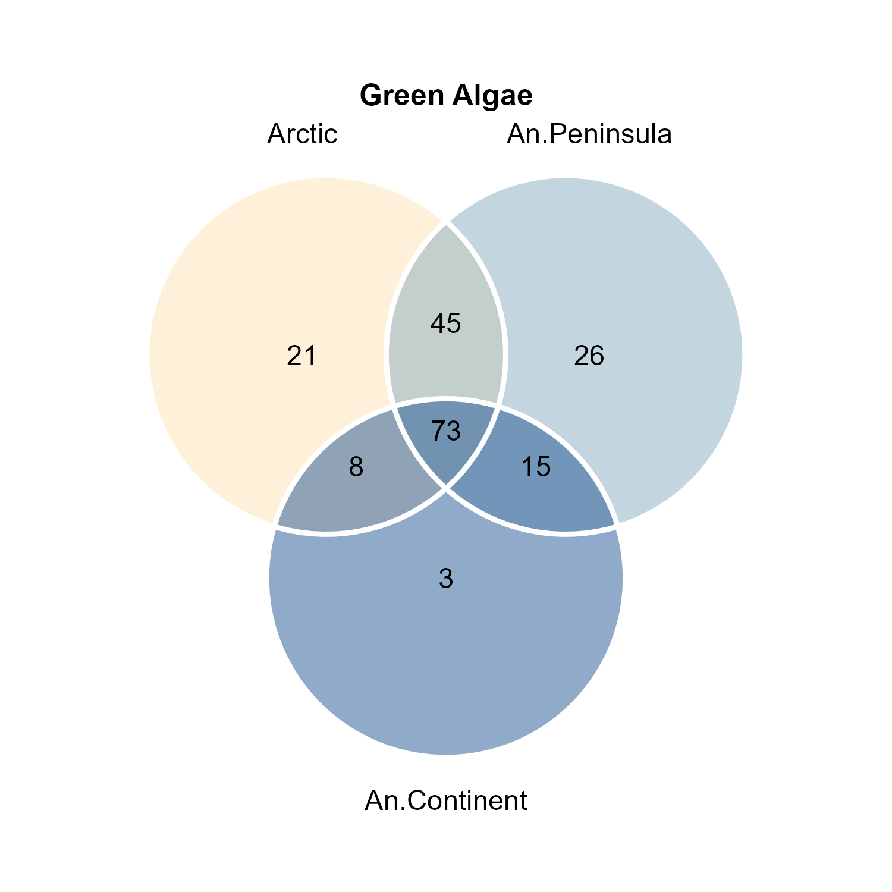
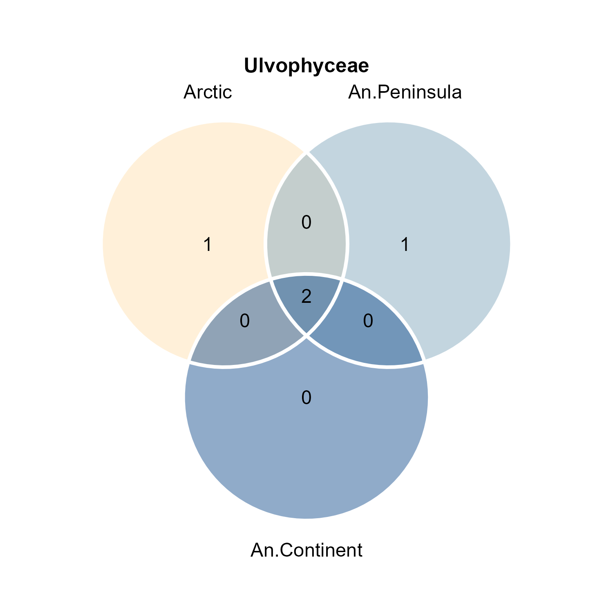
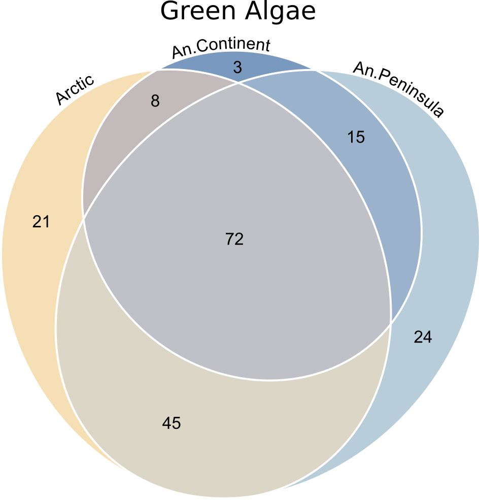

# Venn diagram


Cristina Martínez Rendón  
13-06-2023

**R version:** 4.3.0 (21-04-2023)

**Packages**

``` r
library(tidyverse)
library(ggvenn)

rm(list=ls())

setwd("~/R_Projects/ArcticAntarctica/GreenAlgae")
```

## 1. Data handling 
I start by reading the raw and relativized count tables and then apply several filtering steps to remove unwanted samples and columns, such as outliers and specific sites. The script includes the manipulation of metadata, integration of taxonomic information, and creation of subsets for different regions (Arctic, Antarctic Peninsula, and Antarctic Continent) based on the presence of taxa. Each subset is further enriched with taxonomic classification at the phylum, class, and order levels, enabling more detailed downstream analyses.
``` r
counttable <- read.delim("305WP2PolarGA.unique.agc.txt", header=T,row.names = 1)  # Raw count table

  # Relativized count table. Non-rarefied data, filtered (K2|TOT|TCtr|C1 sites), deleted OTUs that col.summed=0, or those present in =< 3 samples. I need both tables, this one does not have the taxonomy column. This table I produced in the NMDS script.
  relcounttable <- read.table("Species_mat_relativ.txt", header=T,row.names = 1) 
```

### Filter out outliers from the table
``` r
counttable <- counttable[,-which(colnames(counttable) %in% c("SUM","repSeqName","repSeq","mock_community"))]
counttable <- as.data.frame(t(counttable))
row.names(counttable) <- gsub("^X","",row.names(counttable))
counttable <- filter(counttable, !grepl( "K2|TOT|TCtr|unused|C1", row.names(counttable))) 

counttable <- as_tibble(counttable, rownames = "names") %>%
  mutate(names_site = str_replace(names, "(\\d_\\d)(?!.*_An)", "\\1_An")) %>% 
  select(names_site, starts_with("Otu"))
counttable <- as.data.frame(counttable)
row.names(counttable) <- counttable[,1]
counttable <- counttable[, -1]
counttablet <- t(counttable)
counttablet <- as.data.frame(counttablet)


# Split the strings in OTUConTaxonomy, separated by ";"

taxonomy_split <- as_tibble(counttablet, rownames="OTU") %>% 
  dplyr::select(OTU, OTUConTaxonomy) %>% 
  separate(OTUConTaxonomy, sep=";", into = c("Kingdom", "Supergroup", "Phylum", "Class", "Order", "Family", "Genus", "Sp.")) %>% 
  mutate_all(~str_replace_all(., "\\(100\\)", "")) %>% 
  mutate_all(~str_replace_all(., "-", "_"))
taxonomy_split <- as.data.frame(taxonomy_split)
``` 
``` r
### Load the metadata and integrate some of the columns to the counttable
info <- read.table("Cristina_info.txt",header=T, row.names=1)
info <- filter(info, !grepl( "K2|TOT|TCtr|unused|C1", row.names(info)))
info$names <- rownames(info)
rownames(info) <- NULL
info$uniqsample <- paste0(info$set,"_",info$sample)

#Continue with a tibble
info <- as_tibble(info) %>%
  mutate(names_site = str_replace(names, "(\\d_\\d)(?!.*_An)", "\\1_An")) %>% 
  select(names_site, everything()) %>% 
  select(-names)
# write.table(info, "SampleMetadata.txt", sep = "\t", row.names = TRUE)


# I use the counts in the relcounttable instead of on the counttable. 
  relcounttablet <- t(relcounttable)    
  taxonomy_split2 <- taxonomy_split
  rownames(taxonomy_split2) <- taxonomy_split$OTU 
            
  common_rows <- data.frame(rownames(taxonomy_split2) %in% rownames(relcounttablet))
  taxonomy_subset <- taxonomy_split2[unlist(common_rows), ]
  taxonomy_split <- taxonomy_subset

# Integrate columns from the metadata info and subset the samples
  relcounttable$set <- info$set
  relcounttable <- relcounttable[, c("set", names(relcounttable)[-ncol(relcounttable)])]
  counttablent <- relcounttable
``` 

### Subset for the three regions:
``` r
Arctic_sub <- counttablent %>% 
  filter(set=="Arctic") %>% 
  select(-set) %>% 
  t() %>%
  as.data.frame() %>% 
  mutate_all(as.numeric) %>% 
  mutate(Totals = rowSums(.)) %>% 
  mutate(Arctic = Totals > 0) %>%
  select(Arctic)
Arctic_sub$Phylum <- taxonomy_split$Phylum
Arctic_sub$Class <- taxonomy_split$Class
Arctic_sub$Order <- taxonomy_split$Order


An_Pen_sub <- counttablent %>% 
  filter(set=="An_Pen") %>% 
  select(-set) %>% 
  t() %>%
  as.data.frame() %>% 
  mutate_all(as.numeric) %>% 
  mutate(Totals = rowSums(.)) %>% 
  mutate(An_Pen = Totals > 0) %>%
  select(An_Pen)
An_Pen_sub$Phylum <- taxonomy_split$Phylum
An_Pen_sub$Class <- taxonomy_split$Class
An_Pen_sub$Order <- taxonomy_split$Order


An_Cont_sub <- counttablent %>% 
  filter(set=="An_Cont") %>% 
  select(-set) %>% 
  t() %>%
  as.data.frame() %>% 
  mutate_all(as.numeric) %>% 
  mutate(Totals = rowSums(.)) %>% 
  mutate(An_Cont = Totals > 0) %>%
  select(An_Cont)
An_Cont_sub$Phylum <- taxonomy_split$Phylum
An_Cont_sub$Class <- taxonomy_split$Class
An_Cont_sub$Order <- taxonomy_split$Order
``` 


## 2. Plot

### Venn plot for the all green algae
``` r
GreenAlgae_venn <- list(
  Arctic = row.names(Arctic_sub)[Arctic_sub$Phylum == "Chlorophyta" & Arctic_sub$Arctic == TRUE],
  An.Peninsula = row.names(An_Pen_sub)[An_Pen_sub$Phylum == "Chlorophyta" & An_Pen_sub$An_Pen == TRUE],
  An.Continent = row.names(An_Cont_sub)[An_Cont_sub$Phylum == "Chlorophyta" & An_Cont_sub$An_Cont == TRUE]
)

color <- c("#FFE4B5", "#89aec2", "#225895")

GreenAlgae_vennd <- ggvenn(GreenAlgae_venn,
                     fill_color = color,
                     stroke_size = 1, set_name_size = 4,
                     stroke_color = "white",
                     show_percentage = FALSE) +
  ggtitle("Green Algae") +
  theme(plot.title = element_text(size = 12, face = "bold", hjust = 0.5)) +
  theme(plot.margin = margin(1,1,1,1, "cm")); GreenAlgae_vennd
ggsave(file = "Plots/Venn_GreenAlgae.png", dpi=300, width = 5, height = 5)

``` 
### Venn plots for the three most abundant classes

#### Trebouxiophyceae
``` r
Trebouxiophyceae_venn <- list(
  Arctic = row.names(Arctic_sub)[Arctic_sub$Class == "Trebouxiophyceae" & Arctic_sub$Arctic == TRUE],
  An.Peninsula = row.names(An_Pen_sub)[An_Pen_sub$Class == "Trebouxiophyceae" & An_Pen_sub$An_Pen == TRUE],
  An.Continent = row.names(An_Cont_sub)[An_Cont_sub$Class == "Trebouxiophyceae" & An_Cont_sub$An_Cont == TRUE]
)
ggvenn(Trebouxiophyceae_venn,
       fill_color = color,
       stroke_size = 1, set_name_size = 4,
       stroke_color = "white",
       show_percentage = FALSE) +
  ggtitle("Trebouxiophyceae") +
  theme(plot.title = element_text(size = 12, face = "bold", hjust = 0.5)) +
  theme(plot.margin = margin(1,1,1,1, "cm"))
ggsave(file = "Plots/Venn_Trebouxiophyceae.png", dpi=300, width = 5, height = 5)
``` 

#### Chlorophyceae
``` r
Chlorophyceae_venn <- list(
  Arctic = row.names(Arctic_sub)[Arctic_sub$Class == "Chlorophyceae" & Arctic_sub$Arctic == TRUE],
  An.Peninsula = row.names(An_Pen_sub)[An_Pen_sub$Class == "Chlorophyceae" & An_Pen_sub$An_Pen == TRUE],
  An.Continent = row.names(An_Cont_sub)[An_Cont_sub$Class == "Chlorophyceae" & An_Cont_sub$An_Cont == TRUE]
)
ggvenn(Chlorophyceae_venn,
       fill_color = color,
       stroke_size = 1, set_name_size = 4,
       stroke_color = "white",
       show_percentage = FALSE) +
  ggtitle("Chlorophyceae") +
  theme(plot.title = element_text(size = 12, face = "bold", hjust = 0.5)) +
  theme(plot.margin = margin(1,1,1,1, "cm"))
ggsave(file = "Plots/Venn_Chlorophyceae.png", dpi=300, width = 5, height = 5)
``` 

#### Ulvophyceae
``` r
Ulvophyceae_venn <- list(
  Arctic = row.names(Arctic_sub)[Arctic_sub$Class == "Ulvophyceae" & Arctic_sub$Arctic == TRUE],
  An.Peninsula = row.names(An_Pen_sub)[An_Pen_sub$Class == "Ulvophyceae" & An_Pen_sub$An_Pen == TRUE],
  An.Continent = row.names(An_Cont_sub)[An_Cont_sub$Class == "Ulvophyceae" & An_Cont_sub$An_Cont == TRUE]
)
ggvenn(Ulvophyceae_venn,
       fill_color = color,
       stroke_size = 1, set_name_size = 4,
       stroke_color = "white",
       show_percentage = FALSE) +
  ggtitle("Ulvophyceae") +
  theme(plot.title = element_text(size = 12, face = "bold", hjust = 0.5)) +
  theme(plot.margin = margin(1,1,1,1, "cm"))
ggsave(file = "Plots/Venn_Ulvophyceae.png", dpi=300, width = 5, height = 5)
```

 
 
 
 

Not entirely satisfied with the outcome, I chose to use the data I generated here to create a Venn diagram, with the areas approximately representing OTU abundances, using [*eulerr*](https://eulerr.co/). 


